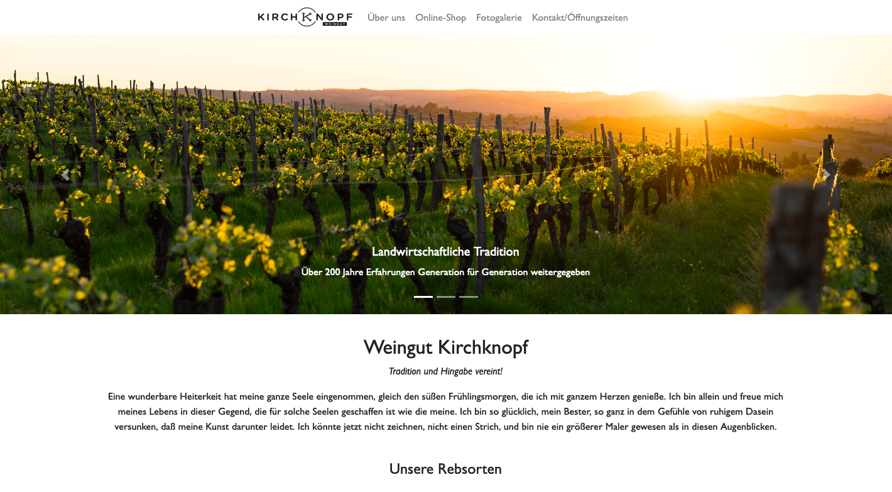

# Webseite Weingut
Hochschule RheinMain - Medieninformatik - Auszeichnungsprachen - Sommersemester 2019
Abgabe von **Sandra Kiefer**



## Installation und Startanweisungen
```sh
$ git clone https://github.com/sandrakiefer/WebseiteWeingut.git
```
Klonen Sie das Projekt in ein beliebiges Verzeichnis von Ihnen und öffnen Sie die Datei **startseite.html** mit einem beliebigem Webbrowser.

## Projektbeschreibung
Ziel war es eine vollständige Webseite zu einem beliebigem Thema zu erstellen. Diese sollte mehrere Themen Seiten beinhalten, ein Menü haben, eine Fotogalerie, eine Tabelle und ein Formular. Für die Gestaltung mit CSS und für ein responsives Verhalten durfte man Bootstrap einbinden.
Mit Hilfe von JavaScript sollte eine Form-Validierung, eine Speicherung dieser Informationen im localStorage und eine Verwaltung der gesammelten Informationen in einer Tabelle mit Filter-Funktion implementiert werden. 

## Demonstrationsvideo
Ein kurzes Demonstrationsvideo finden Sie unter **demovideo.mp4** im Repository.